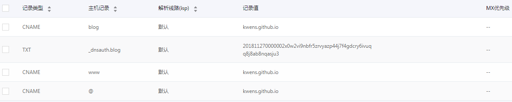

### 一，基本安装

+ github中新建blog项目，项目名为：yourname.github.io（使用此后缀的github项目会自动开启github pages）
+ 如果没有开启github pages，进入项目的setting中找到对应开启的地方进行开启。
+ 本地下载hexo（前提：安装node）
+ 全局安装hexo-cli：npm install -g hexo-cli
+ 创建hexo项目：hexo init yourdir
+ 本地调试：进入yourdir, 安装node依赖包，启用：hexo s --debug
+ 打包： hexo g
+ 配置github地址：
    - 下载安装：hexo-deploy-git: npm i hexo-deploy-git --save
    - 修改配置文件：_config.yml



+ 提交打包后的文件：hexo d
+ 访问yourname.github.io即可看到。

### 二，使用主题：https://hexo.io/zh-cn/docs/themes

+ 可以在themes目录下新建你的主题：一个主题可能包括如下结构
```
 ├── _config.yml
 ├── languages
 ├── layout
 ├── scripts
 └── source
```
+ 我的博客使用的是第三方主题next: http://theme-next.iissnan.com/
    + 在博客源码目录下安装：git clone https://github.com/iissnan/hexo-theme-next themes/next
    + 启用主题：修改_config.yml下的themes字段为next.
        - theme: next
    + 修改其他主题设定，请看文档。

### 绑定域名

+ 注册域名，这里使用的是阿里域名，具体如何申请不再述说。

+ 添加域名解析，例如：

  

+ 在博客源码source目录下新建CNAME文件，并写入你的域名
+ 重新打包并推送到你的github博客项目。
+ 使用域名访问你的博客
